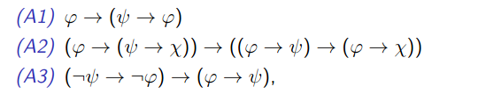
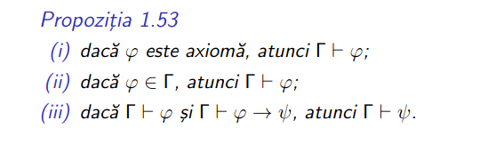
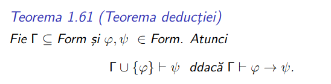
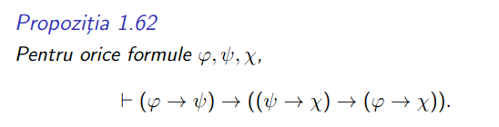
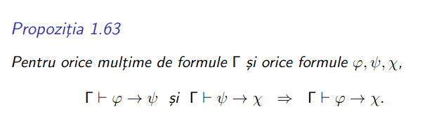
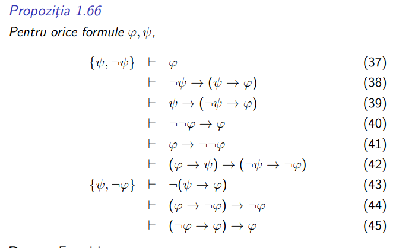

## Table of contents

- [Table of contents](#table-of-contents)
- [Cheat sheet for theorem proofs](#cheat-sheet-for-theorem-proofs)
- [Exercitii](#exercitii)

## Cheat sheet for theorem proofs

**IMPORTANT**
- Noi nu ne vom concentra prea mult pe demonstrarea de teoreme pentru ca valoreaza doar 1p (din 12) la examen, este destul de dificil de explicat intuitia din spate si oricum din 2 - 3 exemple nu invatati prea multe. Noi doar va punem la dispozitie de ce teoreme si propozitii sa va folositi ca sa va fie mai usor sa le demonstrati, adica pozele de mai sus
- Strategia recomandata este sa aveti solutiile la voi (ca aveti voie cu materiale) la cele rezolvate din sursa de mai jos si cele de la seminar
- Totusi, daca chiar vreti sa invatati sa faceti aceste tipuri de exercitii recomand sa va uitati tot pe seminariile din sursa de mai jos fara sa va uitati la solutii (doar seminariile 6 si 7)
- [Seminarii 2021](https://github.com/anamariapanait10/FMI-BS-Resources/tree/master/Year%20I/sem%201/Logica%20matematica%20si%20computationala/seminar)

## Exercitii
Exercitiile 3 si 4 de [aici](../administrative_stuff/written_materials/materiale_1.pdf)